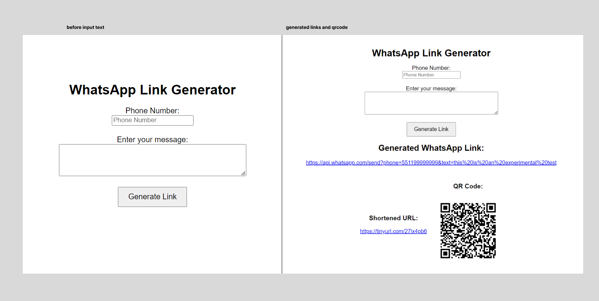

# whatsapp-message-link-generator [ with qr-code-shortened-URL]#  v1.0

#To run the WhatsApp Message Link Generator with QR Code and Shortened URL locally in your web browser, follow these steps:#

Open a terminal 
Clone the GitHub repository to your local machine. 
Run the following command:
git clone https://github.com/artificial-futurist/whatsapp-message-link-generator-qr-code-shortened-URL-.git

Navigate to the project directory:
cd whatsapp-message-link-generator-qr-code-shortened-URL-

on terminal, inside directory
run the command to start the python:
python app.py

The Flask app will start running on a local development server.
You should see an output similar to the following:
* Running on http://127.0.0.1:5000/ (Press CTRL+C to quit)

Open your web browser and enter the following URL: http://127.0.0.1:5000/

Now you can use the WhatsApp Message Link Generator locally in your web browser.
